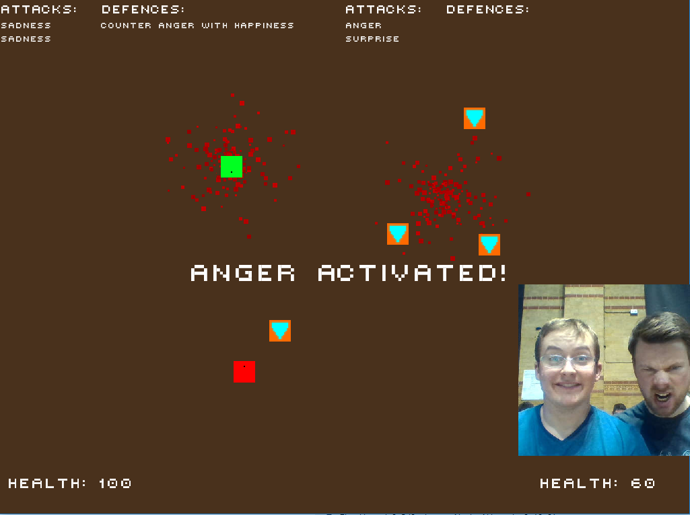

# Face.off!

> Collect weapons and defenses, then activate them by a specific emotion to smash your opponent!

## Usage
- Make sure both of your faces are fully visible to the webcam 
- Move using WASD (Player 1) and arrow keys (Player 2)
- Collect attacks and defences
- Attack or defend by showing the described emotion

## How we built it
We created a custom C++ game engine and connected through Node.js to the Microsoft Emotion API.
